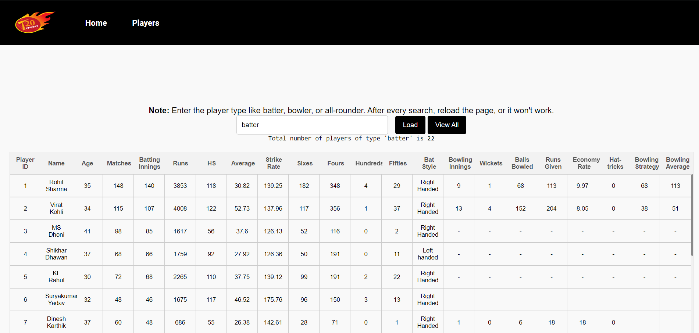

# T20 CricInfo

T20 CricInfo is a web application designed to provide cricket fans with player information, match stats, and comparison tools for T20 cricket. It offers a user-friendly interface for searching and comparing players based on their performance.

## Features

- **Home Page**: Overview of player statistics and T20 records.
- **Player Search**: Search and filter players by name, role, or team.
- **Alphabetical Filter**: Browse players starting with a specific letter.
- **Player Comparison Tool**: Compare statistics of two players side-by-side.
- **About Us**: Information about the team behind T20 CricInfo.

## Snapshots

### Home Page


### Player Search



### Player Comparison Tool


### Alphabetical Filter


## Tech Stack

-  HTML, CSS, JavaScript
## Installation

1. Clone the repository:
   ```bash
   git clone https://github.com/piyush-ghanghav/CrickInfo.git
   ```
2. Open the project in a web browser by launching the `index.html`.

## Contact

Contact us at:  
- tushargaikwad497@gmail.com  
- gawalikaushal7@gmail.com  
- piyushghanghav@gmail.com  
- rghorpade628@gmail.com
```
